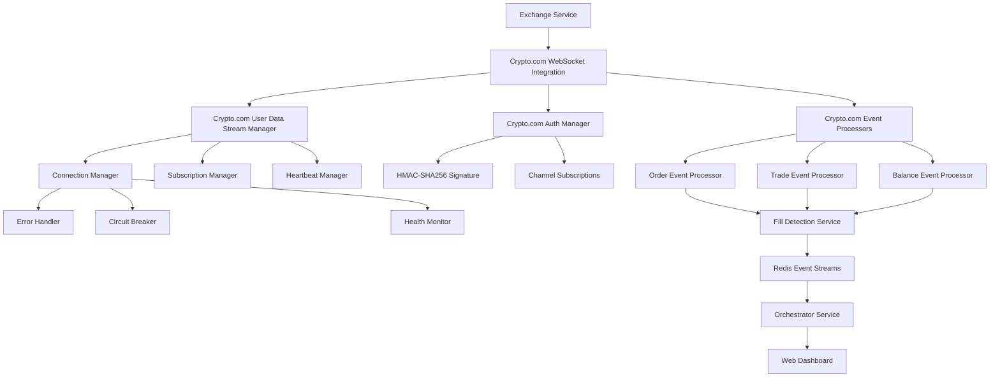

# Crypto.com WebSocket Integration Architecture - Version 2.6.0

## Overview

This document outlines the architecture for integrating Crypto.com's User Data Stream WebSocket into the multi-exchange trading bot system. The implementation provides real-time order execution tracking, account balance updates, and seamless integration with the existing infrastructure.

## Architecture Design

### System Components



## Data Flow Architecture

### 1. WebSocket Connection Flow
```
1. Initialize Crypto.com Auth Manager
   ├── Load API credentials from environment
   ├── Generate signature for authentication
   └── Prepare subscription requests

2. Establish WebSocket Connection
   ├── Connect to wss://stream.crypto.com/exchange/v1/user
   ├── Send authentication message with signature
   ├── Subscribe to channels: user.order, user.trade, user.balance
   └── Start heartbeat mechanism (30s interval)

3. Process Real-time Events
   ├── Receive order status updates
   ├── Process trade execution events
   ├── Handle balance change notifications
   └── Forward to Fill Detection Service
```

### 2. Event Processing Flow
```
Crypto.com WebSocket Event → Event Type Detection → Processor Routing
                                    ↓
┌─────────────────┬─────────────────┬─────────────────┐
│   Order Event   │   Trade Event   │  Balance Event  │
│   Processor     │   Processor     │   Processor     │
└─────────────────┴─────────────────┴─────────────────┘
                                    ↓
              Transform to Standardized Format
                                    ↓
               Redis Event Stream Publication
                                    ↓
                Fill Detection Service
                                    ↓
                Orchestrator Service
                                    ↓
                 Dashboard Updates
```

## Authentication Architecture

### HMAC-SHA256 Signature Process
```python
def generate_signature(api_secret: str, timestamp: int, method: str, path: str, body: str = "") -> str:
    """
    Generate HMAC-SHA256 signature for Crypto.com API authentication
    """
    message = f"{method}{path}{body}{timestamp}"
    signature = hmac.new(
        api_secret.encode('utf-8'),
        message.encode('utf-8'),
        hashlib.sha256
    ).hexdigest()
    return signature
```

### Channel Subscription Process
```json
{
  "id": 1,
  "method": "subscribe",
  "params": {
    "channels": [
      "user.order",
      "user.trade", 
      "user.balance"
    ]
  },
  "api_key": "API_KEY",
  "timestamp": 1234567890,
  "signature": "HMAC_SHA256_SIGNATURE"
}
```

## Event Schema Mapping

### Order Event Structure
```json
{
  "method": "subscription",
  "params": {
    "channel": "user.order",
    "data": {
      "order_id": "12345",
      "client_order_id": "my_order_1",
      "symbol": "BTC_USDC",
      "side": "BUY",
      "type": "LIMIT", 
      "quantity": "0.1",
      "price": "50000.00",
      "status": "FILLED",
      "filled_quantity": "0.1",
      "remaining_quantity": "0.0",
      "created_time": 1234567890000,
      "update_time": 1234567890000
    }
  }
}
```

### Trade Event Structure
```json
{
  "method": "subscription",
  "params": {
    "channel": "user.trade",
    "data": {
      "trade_id": "67890",
      "order_id": "12345",
      "symbol": "BTC_USDC",
      "side": "BUY",
      "quantity": "0.1",
      "price": "50000.00",
      "fee": "5.0",
      "fee_currency": "USDC",
      "trade_time": 1234567890000
    }
  }
}
```

### Balance Event Structure
```json
{
  "method": "subscription", 
  "params": {
    "channel": "user.balance",
    "data": {
      "currency": "USDC",
      "balance": "10000.00",
      "available": "9500.00",
      "frozen": "500.00",
      "update_time": 1234567890000
    }
  }
}
```

## Error Handling Strategy

### Connection Errors
1. **Authentication Failures**
   - Invalid API key/secret
   - Signature generation errors
   - Subscription permission errors

2. **Network Issues**
   - Connection timeouts
   - WebSocket disconnections
   - Heartbeat failures

3. **Rate Limiting**
   - Connection rate limits
   - Subscription rate limits
   - Message frequency limits

### Recovery Mechanisms
1. **Exponential Backoff**: 1s, 2s, 5s, 10s, 30s intervals
2. **Circuit Breaker**: Open after 5 consecutive failures
3. **Graceful Fallback**: Switch to REST API polling
4. **Health Monitoring**: Continuous connection status tracking

## Integration Points

### Fill Detection Service Integration
```python
class CryptocomWebSocketConsumer:
    """Processes Crypto.com WebSocket events for Fill Detection Service"""
    
    async def process_order_event(self, event_data: Dict[str, Any]) -> Dict[str, Any]:
        """Transform Crypto.com order event to standard format"""
        
    async def process_trade_event(self, event_data: Dict[str, Any]) -> Dict[str, Any]:
        """Transform Crypto.com trade event to standard format"""
        
    async def process_balance_event(self, event_data: Dict[str, Any]) -> Dict[str, Any]:
        """Transform Crypto.com balance event to standard format"""
```

### Dashboard Integration
```javascript
// Real-time Crypto.com WebSocket status updates
updateWebSocketIndicators(websocketStatus) {
    const cryptocomIndicator = document.querySelector('[data-websocket-indicator="cryptocom"]');
    const isConnected = websocketStatus.connections?.cryptocom?.connected || false;
    cryptocomIndicator.className = `websocket-indicator ${isConnected ? 'connected' : 'disconnected'}`;
}
```

## Security Considerations

### API Key Protection
1. **Environment Variables**: Store credentials in secure environment variables
2. **Signature Rotation**: Regular API key rotation recommended
3. **Permission Scoping**: Use minimum required API permissions
4. **Connection Encryption**: WSS secure WebSocket connections only

### Data Privacy
1. **Event Filtering**: Only process relevant user data events
2. **Memory Management**: Clear sensitive data after processing
3. **Logging Restrictions**: Never log API keys or signatures
4. **Access Control**: Restrict WebSocket endpoint access

## Performance Optimization

### Connection Management
1. **Single Connection**: One WebSocket connection per exchange
2. **Event Batching**: Batch multiple events for efficient processing
3. **Memory Pooling**: Reuse connection objects and message buffers
4. **Async Processing**: Non-blocking event processing pipeline

### Monitoring Metrics
```python
cryptocom_metrics = {
    "connection_attempts": 0,
    "successful_connections": 0, 
    "messages_received": 0,
    "events_processed": 0,
    "authentication_failures": 0,
    "subscription_errors": 0,
    "heartbeat_failures": 0,
    "circuit_breaker_trips": 0
}
```

## Deployment Configuration

### Environment Variables
```bash
# Crypto.com WebSocket Configuration
CRYPTOCOM_ENABLE_USER_DATA_STREAM=true
CRYPTOCOM_API_KEY=<api-key>
CRYPTOCOM_API_SECRET=<api-secret>
CRYPTOCOM_WEBSOCKET_URL=wss://stream.crypto.com/exchange/v1/user
CRYPTOCOM_HEARTBEAT_INTERVAL=30
CRYPTOCOM_RECONNECT_DELAY=5
CRYPTOCOM_MAX_RECONNECT_ATTEMPTS=5
```

### Docker Integration
```yaml
exchange-service:
  environment:
    - CRYPTOCOM_ENABLE_USER_DATA_STREAM=true
    - CRYPTOCOM_API_KEY=${EXCHANGE_CRYPTOCOM_API_KEY}
    - CRYPTOCOM_API_SECRET=${EXCHANGE_CRYPTOCOM_API_SECRET}
    - CRYPTOCOM_WEBSOCKET_URL=wss://stream.crypto.com/exchange/v1/user
```

## Testing Strategy

### Unit Tests
1. **Authentication Manager**: Signature generation and validation
2. **Event Processors**: Event transformation and validation
3. **Connection Manager**: Connection lifecycle and error handling
4. **Health Monitor**: Status reporting and metrics collection

### Integration Tests
1. **WebSocket Connection**: End-to-end connection establishment
2. **Event Processing**: Real-time event handling pipeline
3. **Error Recovery**: Failure scenarios and recovery mechanisms
4. **Dashboard Integration**: Real-time status updates

### Load Tests
1. **High-Frequency Events**: Handle rapid order/trade updates
2. **Connection Stress**: Multiple reconnection scenarios
3. **Memory Usage**: Long-running connection stability
4. **Failover Performance**: REST API fallback timing

## Rollout Plan

### Phase 1: Core Infrastructure
- Implement WebSocket connection manager
- Add authentication and subscription logic
- Create basic event processors

### Phase 2: Integration
- Integrate with Fill Detection Service
- Add comprehensive error handling
- Implement health monitoring

### Phase 3: User Interface
- Update dashboard with Crypto.com indicators
- Add real-time status displays
- Implement user controls

### Phase 4: Production
- Comprehensive testing suite
- Performance optimization
- Documentation and deployment

---

**Document Version**: 2.6.0  
**Last Updated**: 2025-08-27  
**Status**: Architecture Complete - Ready for Implementation