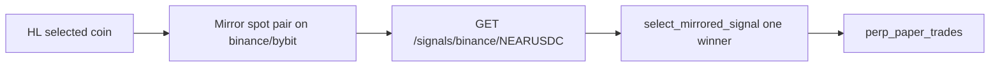
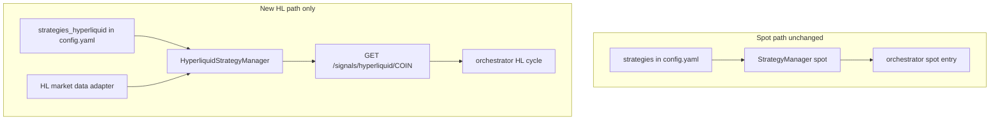

# Hyperliquid perp strategies (forked, separate from spot)

**Branch:** `feature/hyperliquid-perps`  
**Status:** Plan only — not implemented  
**Decisions (from user):** All `strategy_mapping` strategies; forked HL modules; spot paths untouched.

---

## Goal

Run **all 14 strategies** in [`strategy_mapping`](services/strategy-service/main.py) on **Hyperliquid perps** with **long and short** entries/exits, using **HL-native market data** and the **HL open pair universe**. **Spot must remain unchanged**: same `strategies:` config, same `StrategyManager`, same orchestrator spot entry/exit paths.

---

## Current state (what we replace)



| Area | Today |
|------|--------|
| Signals | [`_mirror_strategy_signals_to_hyperliquid`](services/orchestrator-service/main.py) → spot `GET /api/v1/signals/{exchange}/{pair}` |
| Candles | Spot exchange OHLCV on mirrored pair |
| Strategy state | [`BaseStrategy`](strategy/base_strategy.py) long/none oriented |
| HL exits | Global % SL/TP/time in [`should_close_paper_perp`](services/orchestrator-service/hyperliquid_perps.py) |
| HL OHLCV | Not in exchange-service |

**Mapped strategies (all need HL forks):**

`vwma_hull`, `rsi_oversold_checklist`, `rsi_oversold_override`, `macd_momentum`, `heikin_ashi`, `multi_timeframe_confluence`, `engulfing_multi_tf`, `macd_ema_vwap_scalper`, `supertrend`, `swing_hull_rsi_ema`, `pullback_long_scalping`, `breakout_retest_long`, `vwap_bounce_scalping`, `small_size_momentum_scalp`

---

## Target architecture



---

## 1. Configuration split

Add **top-level** sibling to `strategies:` in [`config/config.yaml`](config/config.yaml):

```yaml
strategies_hyperliquid:
  regime_stability: { ... }   # optional copy; HL-only policy
  macd_momentum:
    enabled: true
    venue: hyperliquid
    parameters:
      allow_short: true
      # perp-tuned thresholds, timeframes default 15m + 1h
  # ... one block per strategy name in strategy_mapping ...
```

Under `trading.hyperliquid_perps`:

```yaml
  signal_source: hyperliquid_strategies   # vs legacy mirror_spot
  strategy_consensus:
    min_agreement: 50
    min_confidence_long: 0.55
    min_confidence_short: 0.55
  use_strategy_exits: true
```

**Config-service:** `GET /api/v1/config/strategies-hyperliquid` — returns only `strategies_hyperliquid`.  
**Do not** merge into spot `GET /api/v1/config/strategies`.

**Isolation rule:** Spot orchestrator reads `strategies` only; HL cycle reads `strategies-hyperliquid` only.

After edits: [`./scripts/apply_config.sh`](scripts/apply_config.sh).

---

## 2. Forked strategy modules

**Package:** [`strategy/hyperliquid/`](strategy/hyperliquid/)

| Spot | HL fork (example) |
|------|-------------------|
| `macd_momentum_strategy.py` | `macd_momentum_perp.py` |
| `intraday_long_standalone_strategies` (4 classes) | `breakout_retest_perp.py`, etc. |
| … | `*_perp.py` for each mapping entry |

**Base:** [`strategy/hyperliquid/base_perp_strategy.py`](strategy/hyperliquid/base_perp_strategy.py)

- `position`: `long` \| `short` \| `none`
- `generate_signal` → `buy` \| `sell` \| `hold` (long / short / flat)
- `should_exit(position_side, entry_price, current_price, ...)` — side-aware PnL (align with [`hyperliquid_perps.calculate_perp_pnl`](services/orchestrator-service/hyperliquid_perps.py))
- **No imports** of spot strategy classes from HL modules (fork = copy + adapt)

**Optional shared pure code:** `strategy/common/indicators.py` only if it cannot change spot behavior.

**Per-fork checklist:**

1. Enable shorts where spot is long-only (e.g. engulfing, intraday playbooks).
2. Regime: allow `trending_down` for shorts where appropriate.
3. Stops/targets as % of price for perps.
4. Default timeframes **15m + 1h** for HL config (workspace rule).
5. Descriptive `reason` on every entry/exit.

**Implementation waves:**

| Wave | Strategies | Purpose |
|------|------------|---------|
| A | `macd_momentum`, `breakout_retest_long`, `rsi_oversold_checklist` | Prove pipeline + long/short |
| B | `engulfing_multi_tf`, `heikin_ashi`, `vwma_hull`, `multi_timeframe_confluence` | Multi-TF core |
| C | `macd_ema_vwap_scalper`, `supertrend`, `swing_hull_rsi_ema`, `rsi_oversold_override`, intraday scalps | Full parity |

---

## 3. HL market data

Strategies must not use spot candles on mirrored pairs.

**New:** [`services/exchange-service/hyperliquid_market.py`](services/exchange-service/hyperliquid_market.py)

- `POST https://api.hyperliquid.xyz/info` — `candleSnapshot` for `COIN` + interval
- Normalize to same shape as [`ExchangeAdapter.get_ohlcv`](services/strategy-service/main.py)

**Endpoint:** `GET /api/v1/market/ohlcv/hyperliquid/{coin}?timeframe=&limit=`

**Strategy-service:** `HyperliquidExchangeAdapter` with `exchange_name=hyperliquid`.

Spot CCXT routes: **unchanged**.

---

## 4. Strategy-service: second manager + APIs

**New:** `HyperliquidStrategyManager` (separate module recommended: `hyperliquid_strategy_manager.py`)

- Loads `/api/v1/config/strategies-hyperliquid`
- `hyperliquid_strategy_mapping` → `strategy.hyperliquid.*`
- `analyze_coin(coin: str)` — no spot exchange in path
- **Long/short consensus** (explicit vote counts for buy vs sell)

**Routes:**

| Route | Purpose |
|-------|---------|
| `GET /api/v1/signals/hyperliquid/{coin}` | Full analysis + consensus |
| `GET /api/v1/signals/hyperliquid/{coin}/{strategy_name}` | Single-strategy debug |
| `POST /api/v1/analysis/hyperliquid/{coin}` | On-demand |

**Example response:**

```json
{
  "coin": "ETH",
  "consensus": { "signal": "sell", "confidence": 0.72, "agreement": 55 },
  "strategies": { "macd_momentum_perp": { "signal": "sell", "confidence": 0.8 } },
  "recommended": { "strategy": "macd_momentum_perp", "side": "short" }
}
```

**Startup:** `initialize_hyperliquid_strategies()` alongside existing spot init.  
**Spot routes** `/api/v1/signals/{exchange}/{pair}`: **unchanged**.

---

## 5. Orchestrator HL cycle

Rename/refactor [`_mirror_strategy_signals_to_hyperliquid`](services/orchestrator-service/main.py) → `_run_hyperliquid_strategy_entries`:

1. For each coin in `hyperliquid_pair_selections`
2. `GET {strategy_service}/api/v1/signals/hyperliquid/{coin}`
3. Open paper perp when consensus/policy passes `min_confidence_long` / `min_confidence_short`
4. Persist `source_strategy`, `source_signal`, regime/reasons in `metadata`
5. **Stop using** `find_mirror_spot_pair` for entries when `signal_source: hyperliquid_strategies`

**Exits (layered):**

1. **Per-strategy:** `should_exit` from HL manager (batch in signal response or `exit-advice` endpoint)
2. **Venue fallback:** keep global `stop_loss_pct`, `take_profit_pct`, `max_holding_minutes` in `_update_hyperliquid_paper_positions`

**Migration:** `signal_source: mirror_spot` fallback until Wave B validated.

---

## 6. Database and dashboard

- [`perp_paper_trades`](services/database-service/main.py): use `source_strategy`, `position_side`, `metadata` for per-strategy attribution
- [`get_perp_paper_summary`](services/database-service/main.py) `by_strategy` becomes meaningful
- Portfolio dashboard: optional “HL strategy votes” per coin from last HL analysis snapshot

---

## 7. Testing

| Layer | Tests |
|-------|--------|
| `base_perp_strategy` | Long/short signal + exit unit tests |
| Each `*_perp` | Fixture OHLCV → buy/sell/hold |
| HL OHLCV | Mock Hyperliquid candle JSON |
| API | `GET /signals/hyperliquid/ETH` integration (mocked) |
| Regression | Spot tests unchanged; assert spot manager does not load `strategy.hyperliquid` |

---

## 8. Deploy

Rebuild after implementation: `config-service`, `exchange-service`, `strategy-service`, `orchestrator-service`, `web-dashboard-service` (+ `database-service` if API changes).

---

## 9. Non-goals

- Live HL order signing (paper only for this plan)
- Changing spot `strategies:` flags or spot orchestrator logic
- Applying spot `blacklisted_pairs` to HL (use HL universe + stablecoin exclude unless `blacklisted_coins` added later)

---

## 10. Success criteria

- Spot behavior unchanged when `signal_source` is off or `mirror_spot`
- With `hyperliquid_strategies`: HL coins analyzed by all enabled HL forks; paper opens **long and short** with correct `source_strategy`
- Logs show `[HLStrategy]` / `HyperliquidStrategyManager`, not mirror spot pair fetch

---

## Implementation todos

| ID | Task |
|----|------|
| `hl-config-split` | `strategies_hyperliquid` + config-service endpoint + `signal_source` flag |
| `hl-ohlcv-adapter` | Hyperliquid candles + `GET .../ohlcv/hyperliquid/{coin}` |
| `hl-base-perp` | `strategy/hyperliquid/base_perp_strategy.py` |
| `hl-strategy-manager` | `HyperliquidStrategyManager` + HL signal APIs |
| `hl-wave-a-forks` | macd, breakout_retest, rsi checklist perp forks |
| `hl-orchestrator-wire` | HL entries/exits; deprecate mirror for entries |
| `hl-wave-bc-forks` | Remaining 11 strategy forks |
| `hl-tests-dashboard` | Tests + dashboard strategy breakdown + deploy |
