# Hyperliquid Perp Profit Plan — Design Spec

**Date:** 2026-05-27
**Status:** Implemented (commits 8b44452 → 5c6f4f8 on `feature/hyperliquid-perps`)
**Predecessor:** [2026-05-26-perp-strategy-optimization-design.md](2026-05-26-perp-strategy-optimization-design.md)

## Problem Statement

Lifetime paper-perp PnL for the Hyperliquid mirror engine through
2026-05-27 19:01 UTC across **166 closed trades** (172 total) was
**-$104.37 realized + $71.38 fees** with 55.4% WR but a 2.4× loss/win
asymmetry (avg loss -$2.93 vs avg win +$1.22 — break-even WR ≈ 71%). Two
exit families — `paper_stop_loss` and `paper_max_holding_time` —
accounted for **-$205.52** (54 trades) of the loss while every
`paper_trailing_stop_*` / `paper_profit_protection_breach` bucket
combined was net positive.

Beyond the six fixes from the 2026-05-26 spec, the data exposed three
structural leaks not yet addressed:

1. The 4-hour blind max-hold dumped 19 trades for -$79 at 5.3% WR.
2. The 1.5% fixed stop loss was wrong for high-vol coins (WLD, NEAR,
   ONDO, HYPE, LIT — combined -$76 on 35 trades).
3. With-trend entries in `trending_up`/`trending_down` lost -$73 on
   64 trades; the existing counter-trend gate only blocks the
   opposite case.
4. ~68% of net loss was fees — many entries' expected moves never
   covered the 0.20% round-trip cost.

## Empirical Tables (data source: `scripts/report_hl_paper_pnl.py`)

### By strategy
| Strategy | Trades | PnL | WR | PF |
|---|---:|---:|---:|---:|
| breakout_retest_long | 32 | **-$52.27** | 43.8% | 0.26 |
| heikin_ashi | 28 | -$29.24 | 39.3% | 0.58 |
| vwma_hull | 32 | -$10.64 | 62.5% | 0.66 |
| pullback_long_scalping | 23 | -$8.91 | 78.3% | 0.46 |
| vwap_bounce_scalping | 8 | -$6.93 | 37.5% | 0.38 |
| engulfing_multi_tf | 4 | -$6.44 | 0.0% | — |
| sma_reclaim_bull_flag | 4 | -$1.07 | 50.0% | 0.15 |
| supertrend | 1 | +$0.71 | 100% | — |
| small_size_momentum_scalp | 15 | **+$1.92** | 66.7% | 1.44 |
| macd_ema_vwap_scalper | 1 | +$2.04 | 100% | — |
| swing_hull_rsi_ema | 18 | **+$6.47** | 66.7% | **2.38** |

### By regime × side
| Regime × Side | Trades | PnL |
|---|---:|---:|
| trending_up × long | 44 | **-$51.59** |
| trending_down × short | 20 | -$21.53 |
| trending_up × short | 16 | -$15.07 (fixed by 2026-05-26 counter-trend gate) |
| high_volatility × short | 30 | **+$5.28** |
| sideways × long | 13 | +$2.16 |

### By UTC hour (worst and best)
- Worst: 13 (-$24.33), 21 (-$21.80), 19 (-$15.94), 2 (-$14.88), 4 (-$13.89), 14 (-$12.27)
- Best: 20 (+$13.03), 23 (+$4.20), 16 (+$3.66), 8 (+$3.11), 0 (+$2.05)
- Validates *replacement* of the original 10–12 UTC caution window
  from the 2026-05-26 spec.

### By exit reason bucket
| Bucket | Trades | PnL | WR |
|---|---:|---:|---:|
| paper_stop_loss | 35 | **-$126.13** | 0.0% |
| paper_max_holding_time | 19 | **-$79.39** | 5.3% |
| paper_trailing_stop_* (all) | 60+ | net **positive** | 100% |
| paper_profit_protection_breach (all) | 20+ | net positive | ~70% |

### Coin concentration
- Worst: WLD -$25.48, NEAR -$16.35, ONDO -$14.21, HYPE -$10.22, LIT -$10.18.
- Best: ZEC +$10.39, XMR +$8.75, XPL +$6.36, GMT +$4.43.

---

## Phase Index (implemented)

```mermaid
flowchart LR
    P1[Phase 1: ship 2026-05-26 spec] --> P2[Phase 2: disable losers]
    P2 --> P3[Phase 3: exit logic rework]
    P3 --> P4[Phase 4: empirical caution windows]
    P4 --> P5[Phase 5: trend-chase guard]
    P5 --> P6[Phase 6: fee-aware EV gate]
    P6 --> P7[Phase 7: pnl-weighted sizing]
    P7 --> P8[Phase 8: report script]
    P8 --> P9[Phase 9: this spec]
```



### Phase 1 — Apply pending 2026-05-26 spec (commit 8b44452)
Shipped the six already-coded changes after a clean test run and an
`scripts/apply_config.sh` cycle. Day-of evidence: 2026-05-27 closed
38 trades at 65.6% WR for **+$1.43** — the first profitable day in
the sample.

### Phase 2 — Disable proven losers (commit f674867)
- `engulfing_multi_tf`: `enabled: false` (strategy + gate). Added to
  `DEPRECATED_STRATEGIES` in
  [`services/strategy-service/hyperliquid_strategy_manager.py`](../../services/strategy-service/hyperliquid_strategy_manager.py)
  with a deprecation warning + unit test.
- `vwap_bounce_scalping.parameters.allow_short`: false.
- `breakout_retest_long.parameters.allow_short`: false; standalone
  `min_confidence_long: 0.80`.
- `pullback_long_scalping` standalone: `min_confidence: 0.78`,
  `min_strength: 0.70`.

### Phase 3 — Exit logic rework (commit ee7d841)
Direct attack on the -$205 leak.
- **Breakeven max-hold + salvage trail.** `_max_holding_decision` in
  [`services/orchestrator-service/hyperliquid_perps.py`](../../services/orchestrator-service/hyperliquid_perps.py)
  replaces blind `paper_max_holding_time`:
  - `pct >= -fee_floor` → `paper_max_holding_time_flat` (close near be).
  - `pct <  -fee_floor` → set `metadata.salvage_mode`, keep position
    open until stop loss / trailing / first breakeven touch
    (`paper_max_holding_time_be`) / `max_holding_minutes_hard`
    (`paper_max_holding_time_hard`).
- **ATR-based stop loss.** When trade metadata carries
  `entry_atr_pct`, effective stop = clamp(atr_pct × mult, min, max).
  Fixed-pct fallback preserved. `perp_entry_atr_metadata` reads
  `atr_pct` / `atr_percent` / `atr` / `ATR` from
  `signal.details.indicators` (or `state.indicators`) and normalises
  decimal/absolute forms. Orchestrator stamps the field at trade
  creation.
- **Per-coin stop overrides.** `per_coin_stop_overrides` map seeded
  with WLD/NEAR/ONDO/HYPE/LIT at 1.2%.

### Phase 4 — Empirical caution + block windows (commit 4a895ff)
Replaced the 10–12 UTC window (no data support) with three bands
matching observed worst hours: **02–05, 13–15, 19–22 UTC**. Added a
new `is_block_window` helper gated by
`session_sizing.block_windows_enabled` (default false) that lets us
hard-skip 13 and 21 UTC once caution sizing has been validated in
production.

### Phase 5 — Trend-chase guard (commit 9883bd4)
The counter-trend gate handles shorts-in-trending-up / longs-in-
trending-down. The bigger leak was *with-trend* late entries.
`hyperliquid_trend_chase_gate(signal, regime)` activates only when
side matches the dominant trend and requires either:
- `details.indicators.pullback_depth_pct >= 0.6`, OR
- `details.indicators.rsi_14 <= 60` (longs) / `>= 40` (shorts).

Strategies that emit neither indicator are passthrough. Wired into
`_run_hyperliquid_strategy_entries` between the existing regime
direction gate and the re-entry cooldown.

### Phase 6 — Fee-aware EV gate (commit ed37757)
`hyperliquid_min_edge_gate(signal, hl_cfg)` computes
`expected_move_pct` from the signal (direct → indicator → derived
from `take_profit_pct - stop_loss_pct * (1 - confidence)`) and
blocks entries below `max(min_edge_pct, fee_round_trip *
edge_multiplier)`. Defaults: `min_edge_pct=0.40`, multiplier=2.0
→ effective floor 0.40% at the default 0.001/side fee. Signals
without enough fields are passthrough.

### Phase 7 — PnL-weighted sizing tier (commit 4d8a57f)
`hyperliquid_strategy_pnl_multiplier(strategy, closed_trades, …)`
returns a tier multiplier from rolling realized PnL over a configurable
lookback (default 168h):
- PnL ≥ +$5 → **1.0×** strong
- PnL ≥ 0 → 0.7× normal
- PnL < 0 → 0.4× probation
- < `min_sample` trades → 0.7× neutral (no penalty)

Compounds with existing standalone-gate and regime-gate multipliers.

The current **paper-to-live promotion whitelist** documented in
config:
1. `swing_hull_rsi_ema` (lifetime +$6.47, PF 2.38)
2. `small_size_momentum_scalp` (lifetime +$1.92, PF 1.44)
3. `vwma_hull` longs (+$2.16, 71% WR; shorts pending validation of
   the 0.85 min-confidence raised in Phase 1).

### Phase 8 — Report script (commit 5c6f4f8)
`scripts/report_hl_paper_pnl.py` pulls from database-service and
prints the same tables that drove this spec. Use:

```bash
python3 scripts/report_hl_paper_pnl.py            # all time
python3 scripts/report_hl_paper_pnl.py --hours 24
python3 scripts/report_hl_paper_pnl.py --hours 168
```

---

## File Change Summary

| File | Touched in phases |
|---|---|
| `config/config.yaml` | 1, 2, 3, 4, 6, 7 |
| `services/orchestrator-service/hyperliquid_perps.py` | 1, 3, 4, 5, 6, 7 |
| `services/orchestrator-service/main.py` | 1, 4, 5, 6, 7 |
| `services/strategy-service/hyperliquid_strategy_manager.py` | 1, 2 |
| `tests/unit/test_hyperliquid_perps.py` | 1, 3, 4, 5, 6, 7 |
| `tests/unit/test_hyperliquid_strategy_manager.py` | 1, 2 |
| `scripts/report_hl_paper_pnl.py` | 8 (new) |
| `docs/superpowers/specs/2026-05-27-perp-profit-plan-design.md` | 9 (this doc) |

98 unit tests across the two perp test files green at the end of
Phase 7. Each phase also passed `./scripts/apply_config.sh` so the
running stack is up to date.

## Acceptance Criteria
- 4 consecutive paper days with realized PnL > 0 after Phase 3.
- Per-strategy 7-day rolling profit factor ≥ 1.2 before any strategy
  is added to the live whitelist.
- `paper_max_holding_time*` exit family (legacy + flat + be + hard
  combined) contributes ≥ -$5 (down from -$79) over the next 96
  hours.
- `breakout_retest_long` 7-day PnL ≥ 0 OR strategy fully disabled at
  the end of week.
- Fees ≤ 35% of gross PnL over rolling 7 days (currently 68%).

## Verification
Run after each meaningful change:

```bash
TESTING=1 python3 -m pytest \
  tests/unit/test_hyperliquid_perps.py \
  tests/unit/test_hyperliquid_strategy_manager.py -q

./scripts/apply_config.sh

python3 scripts/report_hl_paper_pnl.py --hours 24
```

## Out of Scope
- Live order routing on Hyperliquid (paper-only until the
  acceptance criteria are met).
- Spot trading stack changes.
- Per-coin machine-learning scoring — revisit once Phases 3–6
  stabilize.
- Heikin Ashi / engulfing_multi_tf strategy code — left intact,
  gated off.
